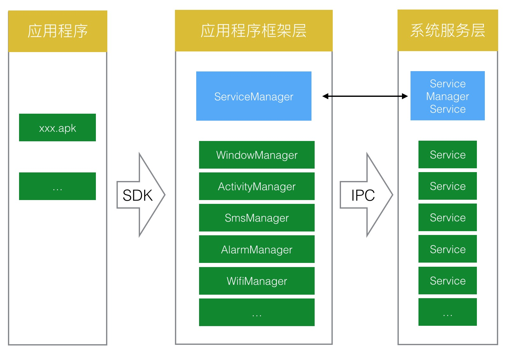
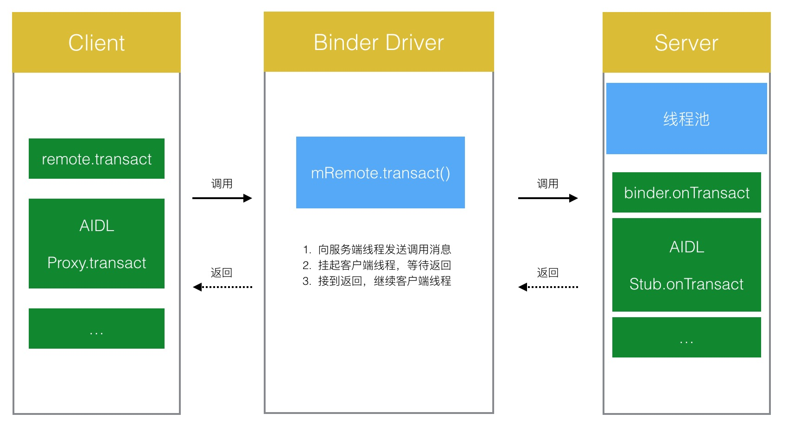

# 轻松理解 Android Binder
在 Android 系统中，Binder 起着非常重要的作用，它是整个系统 IPC 的基石。网上已经有很多文章讲述 Binder 的原理，有的讲的比较浅显，没有触及到关键，有的讲的太过于深入底层，难以理解，本文会比较全面，以一个比较轻松的方式，从面到点，大处着眼，小处着手的形式去讲述 Binder 在 Android 中是如何使用的。理解 Binder 的基本原理，对学习 Android 也有很大的帮助，很多问题也能够得到解释，例如 ContentProvider 中的 CRUD 是否是线程安全的？又例如在使用 AIDL 的时候，在 Service 中实现的接口是否是线程安全的？

本文分为以下几个部分去介绍

* Android 整体架构
* Binder IPC 的架构
* 手动实现 Binder IPC
* 使用 AIDL 实现 Binder IPC

如果觉得文章太长，可以先只看「小结」部分，小结会把每个部分的重点总结出来，有些部分可以跳过。


##Android 整体架构
不识庐山真面目，只缘身在此山中，所以我们先来大概看下 Android 这座大山的整体轮廓。我们先从 Android 的整体架构来看看 Binder 是处于什么地位，这张图引自 Android 项目开源网站：https://source.android.com


从下往上依次为

* 内核层：Linux 内核和各类硬件设备的驱动，这里需要注意的是，Binder IPC 驱动也是在这一层实现，比较特殊
* 硬件抽象层：封装「内核层」硬件驱动，提供可供「系统服务层」调用的统一硬件接口
* 系统服务层：提供核心服务，并且提供可供「应用程序框架层」调用的接口
* Binder IPC 层：作为「系统服务层」与「应用程序框架层」的 IPC 桥梁，互相传递接口调用的数据，实现跨进层的通讯
* 应用程序框架层：这一层可以理解为 Android SDK，提供四大组件，View 绘制体系等平时开发中用到的基础部件

在一个大的项目里面，分层是非常重要的，处于最底层的接口最具有「通用性」，接口粒度最细，越往上层通用性降低。理论上来说上面的每一层都可以「开放」给开发者调用，例如开发者可以直接调用硬件抽象层的接口去操作硬件，或者直接调用系统服务层中的接口去直接操作系统服务，甚至是像 Windows 开发一样，开发者可以在内核层写程序，运行在内核中。不过开放带来的问题就是开发者权利太大，对于系统的稳定性是没有任何好处的，一个病毒制作者写了一个内核层的病毒，系统也许永远也起不来了。所以谷歌的做法是将开发者的权利收拢到了「应用程序框架层」，开发者只能调用这一层提供的接口。

上面的层次中，内核层与硬件抽象层均用 C/C++ 实现，系统服务层是以 Java 实现，硬件抽象层编译为 so 文件，以 JNI 的形式供系统服务层使用。系统服务层中的服务随系统的启动而启动，只要不关机，就会一直运行。这些服务干什么事情呢？其实很简单，就是完成一个手机该有的核心功能如短信的收发管理、电话的接听、挂断以及应用程序的包管理、Activity 的管理等等。每一个服务均运行在一个独立进程中，因为是以 Java 实现，所以本质上来说就是运行在一个独立进程的 Dalvik 虚拟机中。问题就来了，开发者的 APP 运行在一个新的进程空间，如何调用到系统服务层中的接口呢？答案是 IPC（Inter-Process Communication），进程间通讯，缩写与 RPC（Remote Procedure Call）是不一样的，实现原理也是不一样的。每一个系统服务在应用层序框架层都有一个 Manager 与之对应，方便开发者调用其相关的功能，具体关系大致如下


IPC 的方式有很多种，例如 socket、共享内存、管道、消息队列等等，我们就不去深究为何要使用 Binder 而不使用其他方式去做，到目前为止，这座大山的面目算是有个大概的轮廓了。
###小结
* Android 从下而上分了内核层、硬件抽象层、系统服务层、Binder IPC 层、应用程序框架层
* Android 中「应用程序框架层」以 SDK 的形式开放给开发者使用，「系统服务层」中的核心服务随系统启动而运行，通过应用层序框架层提供的 Manager 实时为应用程序提供服务调用。系统服务层中每一个服务运行在自己独立的进程空间中，应用程序框架层中的 Manager 通过 Binder IPC 的方式调用系统服务层中的服务。

这一小节完了，看个美女放松下，继续下一小节


## Binder IPC 的架构
下面我们就来看看 Binder IPC 的架构是怎样的


Binder IPC 属于 C/S 结构，Client 部分是用户代码，用户代码最终会调用 Binder Driver 的 transact 接口，Binder Driver 会调用 Server，这里的 Server 与 service 不同，可以理解为 Service 中 onBind 返回的 Binder 对象，请注意区分下。

* Client：用户需要实现的代码，如 AIDL 自动生成的接口类
* Binder Driver：在内核层实现的 Driver
* Server：这个 Server 就是 Service 中 onBind 返回的 IBinder 对象

需要注意的是，上面绿色的色块部分都是属于用户需要实现的部分，而蓝色部分是系统去实现了。也就是说 Binder Driver 这块并不需要知道，Server 中会开启一个线程池去处理客户端调用。为什么要用线程池而不是一个单线程队列呢？试想一下，如果用单线程队列，则会有任务积压，多个客户端同时调用一个服务的时候就会有来不及响应的情况发生，这是绝对不允许的。

对于调用 Binder Driver 中的 transact 接口，客户端可以手动调用，也可以通过 AIDL 的方式生成的代理类来调用，服务端可以继承 Binder 对象，也可以继承 AIDL 生成的接口类的 Stub 对象。这些细节下面继续接着说，这里暂时不展开。

切记，这里 Server 的实现是线程池的方式，而不是单线程队列的方式，区别在于，单线程队列的话，Server 的代码是线程安全的，线程池的话，Server 的代码则不是线程安全的，需要开发者自己做好多线程同步。

### 小结
* Binder IPC 属于 C/S 架构，包括 Client、Driver、Server 三个部分
* Client 可以手动调用 Driver 的 transact 接口，也可以通过 AIDL 生成的 Proxy 调用
* Server 中会启动一个「线程池」来处理 Client 的调用请求，处理完成后将结果返回给 Driver，Driver 再返回给 Client

这里就回答了开篇提问的两个问题：Service 中通过 AIDL 提供的接口并不是线程安全的，同理 ContentProvider 底层也是使用 Binder，同样不是线程安全的，至于是否需要做多线程保护，看业务而定，最好是做好多线程同步，以防万一。

##手动实现 Binder IPC
通过上面的讲解，大家应该对整体的流程已经有了清楚的认识，下面我们先来看看如何手动实现 Binder IPC，即不使用 AIDL 的方式。对应上面的 Client、Driver、Server，在 Activity、Service 中分别是什么呢？

上文说的 Server 其实就是 Service 中 onBind 返回的 IBinder 对象。

### Server

假如我们要做一个上报数据的功能，运行在 Service 中，在后台上报数据，接口定义如下

```
public interface IReporter {

    int report(String values, int type);
}
```

那如何拿到它的 Server 对象呢？答案是通过 Service 的 onBind 方法返回，实现如下
#### BindService.java

```
public class BinderService extends Service {

    public static final int REPORT_CODE = 0;

    public interface IReporter {
        int report(String values, int type);
    }

    public final class Reporter extends Binder implements IReporter {
        @Override
        protected boolean onTransact(int code, Parcel data, Parcel reply, int flags) throws RemoteException {
            return super.onTransact(code, data, reply, flags);
        }

        @Override
        public int report(String values, int type) {
            return type;
        }
    }

    private Reporter mReporter;

    public BinderService() {
        mReporter = new Reporter();
    }

    @Override
    public IBinder onBind(Intent intent) {
        return mReporter;
    }
}
```
这里我暂时不写 onTransact 的实现部分，最主要的是继承 Binder 对象，这个是 Android SDK 提供的基类，它实现了 IBinder 接口，并且封装了底层的 Binder Driver，看看它是如何初始化的
####Binder.java

```
public Binder() {
	init();

	...
}

...

private native final void init();
```
这里调用 native 的一个 init 方法，我们就不去深究了，知道它是对底层的 Binder Driver 的封装即可。当客户端发起请求的时候，Binder Driver 会调用它的 execTransact 方法，并在内部调用到 onTransact 方法，用户端代码可以重载该方法去实现自己的业务逻辑代码。我们的实现方式如下
#### BindService.java

```
protected boolean onTransact(int code, Parcel data, Parcel reply, int flags) throws RemoteException {
    switch (code) {
        case REPORT_CODE:
            data.enforceInterface("reporter");
            String values = data.readString();
            Log.i("IReporter", "data is '" + values + "'");
            int type = data.readInt();
            int result = report(values, type);
            reply.writeInterfaceToken("reporter");
            reply.writeInt(result);
            return true;
    }
    return super.onTransact(code, data, reply, flags);
}
```
这里的主要过程就是：获取到 data 中传递过来的参数 values 和 type，调用自己实现的 report 函数，将返回值写到 reply 中。

注意，这里实现的两个关键点就是

* Reporter 类继承 Binder 类，重载 onTransact 函数，实现自己的业务逻辑
* 在 Service 的 onBind 中返回 Reporter 类的实例

这里看不到半点线程池的影子对吧，其实是在 Binder 内部的 native 方法中去实现了的，记住你写的代码要保持线程安全就对了。

### Driver
该部分已经被 Binder 类给封装了，暴露给开发者的已经是很简单的使用方式了，即继承 Binder，实现 onTransact 即可。

### Client
那 Client 是什么呢？也就是我们想使用 IReport 接口来做数据上报的地方，一般都在 Activity 里面，主要实现如下
####MainActivity.java

```
private IBinder mReporterBind;

private class BindConnection implements ServiceConnection {

    @Override
    public void onServiceConnected(ComponentName name, IBinder service) {
        mReporterBind = service;
    }

    @Override
    public void onServiceDisconnected(ComponentName name) {
        mReporterBind = null;
    }
}

...

@Override
protected void onCreate(Bundle savedInstanceState) {

    ...
    
    intent = new Intent(this, BinderService.class);
    bindService(intent, new BindConnection(), BIND_AUTO_CREATE);
}
    
```

这样就拿到了后台 Service 中的 onBind 返回的 IBinder 对象，也就是上面 Binder IPC 架构中的 mRemote 对象。至于 bindService 中做了什么，有兴趣的读者可以再去研究，这里知道它返回的就是 mRemote 对象即可。
####MainActivity.java

```
Parcel data = Parcel.obtain();
Parcel reply = Parcel.obtain();
data.writeInterfaceToken("reporter");
data.writeString("this is a test string.");
data.writeInt(type);

mReporterBind.transact(BinderService.REPORT_CODE, data, reply, 0);
reply.enforceInterface("reporter");
int result = reply.readInt();

data.recycle();
reply.recycle();
```
通过 Parcel.obtain() 获取发送包对象、应答包对象，写入数据，调用 IBinder 的 transact 接口，即 mRemote.transact() 的调用。

###小结
* 一切复杂的逻辑均已经被封装在实现了 IBinder 接口的 Binder 类中
* Activity 中通过 bindService 拿到 Binder Driver 中的 mRemote 对象（IBinder 的实例），然后「组包」，然后「调用 transact 接口」按序发送数据包
* Service 中继承 Binder 类，「重载 onTransact 函数」，实现参数的「解包」，发送返回包等，在 onBind 中返回具体的实现类 如上文中的 Reporter

总的说来就是 Client 组包，调用 transact 发送数据，Server 接到调用，解包，返回，下面使用 AIDL 的流程本质也是一样。

##使用 AIDL 实现 Binder IPC
上面的例子我们看到，定义了 IReporter 接口，但是其实 Client 中并没有用到，因为数据的组包和解包其实是手动编码的，并不能直接调用接口，所以其实定义接口的意义等于 0，基于此，Android 给了我们更好用的方式那就是 AIDL，定义如下
####IReporter.aidl
```
package com.android.binder;

interface IReporter {

    int report(String values, int type);
}
```

###Server
####AidlService.java
```
public class AidlService extends Service {

    public static final class Reporter extends IReporter.Stub {

        @Override
        public int report(String values, int type) throws RemoteException {
            return type;
        }
    }

    private Reporter mReporter;

    public AidlService() {
        mReporter = new Reporter();
    }

    @Override
    public IBinder onBind(Intent intent) {
        return mReporter;
    }
}
```
这里与手动实现的方式不同的是，一个继承了 Binder，一个继承了 AIDL 自动生成的 Stub 对象，它是什么呢？我们可以看下它的定义
####IReporter.java

```
public interface IReporter extends android.os.IInterface
{

	public static abstract class Stub extends android.os.Binder implements com.android.binder.IReporter {
		...
		
		@Override
		public boolean onTransact(int code, android.os.Parcel data, android.os.Parcel reply, int flags) throws android.os.RemoteException
		{
			switch (code)
			{
				case INTERFACE_TRANSACTION:
				{
					reply.writeString(DESCRIPTOR);
					return true;
				}
				case TRANSACTION_report:
				{
					data.enforceInterface(DESCRIPTOR);
					java.lang.String _arg0;
					_arg0 = data.readString();
					int _arg1;
					_arg1 = data.readInt();
					int _result = this.report(_arg0, _arg1);
					reply.writeNoException();
					reply.writeInt(_result);
					return true;
				}
			}
			return super.onTransact(code, data, reply, flags);
		}
	}

...

}
```
其实和我们上文的写法是一样的，自动生成的 IReporter 类自动给我们处理了一些参数的组包和解包而已，在 case 语句中调用了 this.report 即可调用到自己的业务逻辑部分了。

### Driver 
与上文一致，还是 Binder 的内部封装

### Client
####MainActivity.java
```
private IReporter mReporterAidl;

private class AidlConnection implements ServiceConnection {

    @Override
    public void onServiceConnected(ComponentName name, IBinder service) {
        mReporterAidl = IReporter.Stub.asInterface(service);
    }

    @Override
    public void onServiceDisconnected(ComponentName name) {
        mReporterAidl = null;
    }
}

...

@Override
protected void onCreate(Bundle savedInstanceState) {

    ...
    
    Intent intent = new Intent(this, AidlService.class);
    bindService(intent, new AidlConnection(), BIND_AUTO_CREATE);
}
```

这里与手动实现方式也有区别，即调用了 Stub 对象的 asInterface，具体做了什么呢？

```
public static com.android.binder.IReporter asInterface(android.os.IBinder obj)
{
	if ((obj==null)) {
		return null;
	}
	android.os.IInterface iin = obj.queryLocalInterface(DESCRIPTOR);
	if (((iin!=null)&&(iin instanceof com.android.binder.IReporter))) {
		return ((com.android.binder.IReporter)iin);
	}
	return new com.android.binder.IReporter.Stub.Proxy(obj);
}
```
先查找本地接口是否存在，判断是否是本地调用，如果是则直接返回 IReporter 的对象，否则返回 Stub.Proxy 对象，这个 Proxy 对象是做什么的呢？

```
private static class Proxy implements com.android.binder.IReporter
{
	private android.os.IBinder mRemote;
	Proxy(android.os.IBinder remote)
	{
		mRemote = remote;
	}
	@Override public android.os.IBinder asBinder()
	{
		return mRemote;
	}
	public java.lang.String getInterfaceDescriptor()
	{
		return DESCRIPTOR;
	}
	@Override public int report(java.lang.String values, int type) throws android.os.RemoteException
	{
		android.os.Parcel _data = android.os.Parcel.obtain();
		android.os.Parcel _reply = android.os.Parcel.obtain();
		int _result;
		try {
			_data.writeInterfaceToken(DESCRIPTOR);
			_data.writeString(values);
			_data.writeInt(type);
			mRemote.transact(Stub.TRANSACTION_report, _data, _reply, 0);
			_reply.readException();
			_result = _reply.readInt();
		}
		finally {
			_reply.recycle();
			_data.recycle();
		}
		return _result;
	}
}
```

基本上已经很明了了，就是一个代理对象，对调用接口参数做组包而已，然后调用了 mRemote.transact 接口，和上文手动实现的方式是一致的。

###小结
* AIDL 自动生成了 Stub 类
* 在 Service 端继承 Stub 类，Stub 类中实现了 onTransact 方法实现了「解包」的功能
* 在 Client 端使用 Stub 类的 Proxy 对象，该对象实现了「组包」并且调用 transact 的功能

有了 AIDL 之后，IReporter 接口就变得有意义了，Client 调用接口，Server 端实现接口，一切「组包」、「解包」的逻辑封装在了 Stub 类中，一切就是那么完美。


